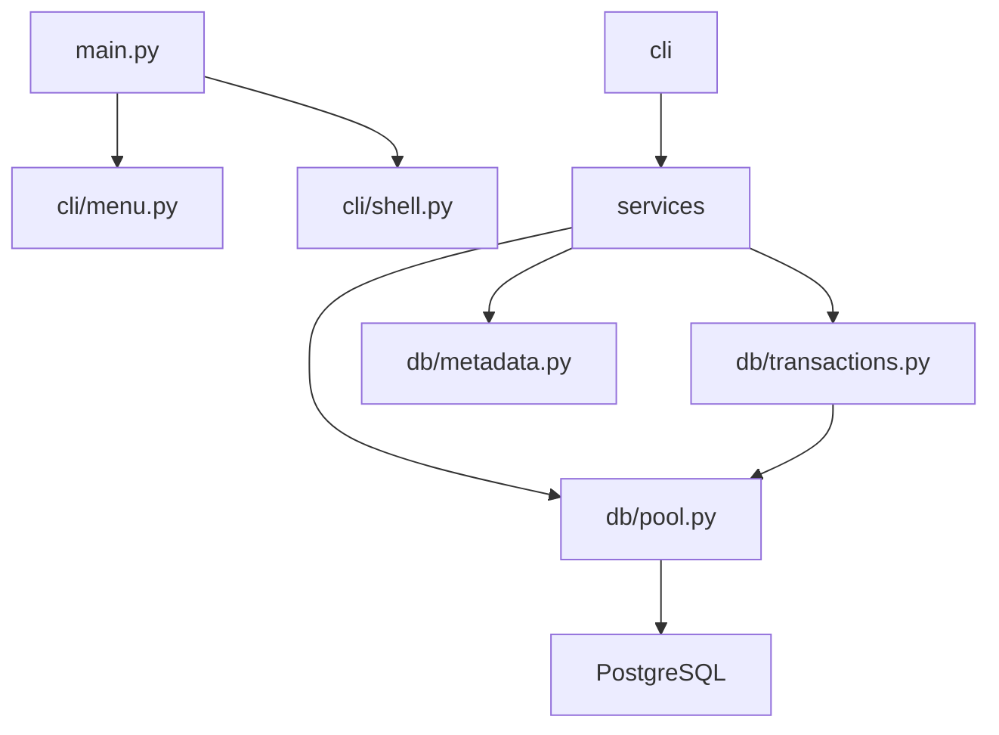

# LOCAL DBMS — Lightweight PostgreSQL Administration CLI

A terminal-based PostgreSQL administration tool built with Python.  
Manage tables, records, indexes, users, imports, exports, and backups — all without writing SQL manually.

---

## Architecture



---

## Features

| # | Feature | Description |
|---|---------|-------------|
| 1 | Create Table | Define columns with datatypes and constraints interactively |
| 2 | Show Tables | List all tables in the public schema |
| 3 | Describe Table | View columns, types, nullability, defaults, PKs, FKs |
| 4 | Drop Table | Permanently remove a table (requires typing table name) |
| 5 | Insert Record | Add a new row to any table |
| 6 | View Records | Paginated display of all rows |
| 7 | Search Records | Multi-column case-insensitive search with sort + pagination |
| 8 | Update Record | Edit specific fields of an existing row |
| 9 | Delete Record | Remove a row by ID (with confirmation) |
| 10 | Export CSV | Export a table to a timestamped CSV file |
| 11 | Import CSV | Validate, preview, and bulk-insert rows from a CSV |
| 12 | DB Stats | Row count, size, index size, column count per table |
| 13 | Backup DB | Dump the database using `pg_dump` |
| 14 | Explorer | Tree view of tables, views, indexes, sequences |
| 15 | List Indexes | Show all indexes for a table |
| 16 | Create Index | Create a regular or unique index |
| 17 | Drop Index | Drop a non-primary index |
| 18 | EXPLAIN | Run EXPLAIN or EXPLAIN ANALYZE on any SELECT |
| 19 | Restore DB | Restore from a `.sql` backup using `psql` |
| 20 | List Roles | Show all PostgreSQL roles |
| 21 | Create Role | Create a login or non-login role |
| 22 | Drop Role | Drop a role |
| 23 | Grant | Grant SELECT/INSERT/UPDATE/DELETE/ALL on a table |
| 24 | Revoke | Revoke privileges from a role |
| s | Shell Mode | Interactive `localdb>` shell with command-line interface |

---

## Project Structure

```
local_dbms/
│
├── cli/
│   ├── menu.py           # Terminal menu renderer
│   └── shell.py          # Interactive localdb> shell
│
├── db/
│   ├── config.py         # Loads DB_CONFIG + pool/page settings from .env
│   ├── pool.py           # psycopg_pool.ConnectionPool singleton
│   ├── transactions.py   # transaction() and readonly_cursor() context managers
│   └── metadata.py       # All metadata queries (tables, columns, indexes, FK, stats)
│
├── services/
│   ├── table_service.py  # create, show, describe, drop, explore
│   ├── record_service.py # insert, view (paginated), search, update, delete
│   ├── index_service.py  # list, create, drop indexes + EXPLAIN
│   ├── import_service.py # CSV import with validation, preview, transaction
│   ├── export_service.py # CSV export with timing
│   ├── stats_service.py  # DB statistics
│   ├── backup_service.py # pg_dump backup + psql restore
│   └── user_service.py   # Role management
│
├── utils/
│   ├── formatters.py     # Colored output, display_table, pagination, tree view
│   ├── display.py        # Backward-compat shim → formatters
│   ├── helpers.py        # select_table, get_table_columns, get_editable_columns
│   ├── validators.py     # non_empty, positive_int, safe_identifier
│   └── logging_setup.py  # Rotating file + console logging
│
├── crud/                 # Backward-compat shims → services (preserved)
│
├── tests/
│   ├── conftest.py       # Session fixtures, test table, pool teardown
│   ├── test_validators.py
│   ├── test_metadata.py
│   ├── test_transactions.py
│   ├── test_crud.py
│   ├── test_indexes.py
│   ├── test_csv.py
│   └── test_stats.py
│
├── imports/              # Place CSV files here before importing
├── exports/              # Exported CSVs saved here
├── backups/              # SQL dump files saved here
├── logs/                 # dbms.log (rotating, 5 MB × 3)
│
├── main.py               # Entry point
├── requirements.txt
├── pytest.ini
├── ruff.toml
├── Dockerfile
├── docker-compose.yml
├── .env                  # Not committed
├── .gitignore
└── README.md
```

---

## Technology Stack

| Package | Purpose |
|---------|---------|
| `psycopg` 3 | PostgreSQL driver (binary) |
| `psycopg-pool` | Connection pooling |
| `python-dotenv` | Load `.env` config |
| `tabulate` | Render tables in terminal |
| `colorama` | Cross-platform colored output |
| `pytest` + `pytest-cov` | Testing + coverage |
| `ruff` | Linting + formatting |

---

## Setup

### Prerequisites

- Python 3.12+
- PostgreSQL 14+ with `pg_dump` and `psql` in PATH

### Installation

```bash
git clone <repo-url>
cd local_dbms

python -m venv dbenv
source dbenv/bin/activate       # Windows: dbenv\Scripts\activate

pip install -r requirements.txt
```

### Environment Variables

Create a `.env` file in the project root:

```env
DB_HOST=localhost
DB_PORT=5432
DB_NAME=<your_database>
DB_USER=<your_user>
DB_PASSWORD=<your_password>

# Optional
POOL_MIN_SIZE=1
POOL_MAX_SIZE=5
PAGE_SIZE=20
EXPORT_DIR=exports
IMPORT_DIR=imports
BACKUP_DIR=backups
LOG_DIR=logs
```

### Run

```bash
python main.py

# Start directly in shell mode
python main.py --shell
```

---

## CLI Usage

### Menu Mode

```
┌────────────────────────────────────────────────────────────────────────────┐
│              LOCAL DBMS — PostgreSQL Administration CLI                    │
├──────────────────────┬──────────────────────┬──────────────────────┬───── │
│ DATABASE             │ RECORDS              │ IMPORT / EXPORT      │ ...  │
├──────────────────────┼──────────────────────┼──────────────────────┼───── │
│ 1. Create Table      │ 5. Insert            │ 10. Export CSV       │ ...  │
│ 2. Show Tables       │ 6. View              │ 11. Import CSV       │ ...  │
│ ...                                                                        │
│  s. Interactive Shell    0. Exit                                           │
└────────────────────────────────────────────────────────────────────────────┘
```

### Shell Mode

```
localdb> tables
localdb> describe users
localdb> select users
localdb> search users email alice
localdb> indexes users
localdb> stats
localdb> explorer
localdb> backup
localdb> import
localdb> export
localdb> sql
localdb> help
localdb> exit
```

### SQL Console (from shell)

```
localdb> sql

sql> SELECT * FROM users WHERE age > 25 ORDER BY name;
sql> EXPLAIN ANALYZE SELECT * FROM users WHERE email = 'alice@example.com';
sql> exit
```

---

## Examples

### Create a table

```
Enter Choice: 1
Enter Table Name: products
Enter Number of Columns: 2

Column 1:
  Column Name: name
  Data Type: 3 (TEXT)
  NOT NULL? y
  UNIQUE? n

Column 2:
  Column Name: price
  Data Type: 7 (FLOAT)
  NOT NULL? y
  UNIQUE? n

✓ Table 'products' created successfully!
```

### Paginated view

```
Enter Choice: 6
  1. products

Enter Table Number: 1

╒════╤══════════╤═════════╕
│ id │ name     │ price   │
╞════╪══════════╪═════════╡
│  1 │ Widget A │ 9.99    │
│  2 │ Widget B │ 14.99   │
╘════╧══════════╧═════════╛

  Page 1/5  ·  Showing 20 of 100 rows  ·  Commands: next · prev · first · last · page N · exit

> next
```

### CSV Import

```
Enter Choice: 11

Available CSV files in 'imports/':
  1. products_bulk.csv

Enter CSV number or filename: 1
  File   : products_bulk.csv
  Table  : products
  Rows   : 10,000

Preview (first 5 rows):
╒══════════╤═════════╕
│ name     │ price   │
╞══════════╪═════════╡
│ Widget A │ 9.99    │
...

Import all 10,000 rows into 'products'? (y/n): y

✓ Import complete!
  Inserted : 9,982
  Skipped  : 18
  Time     : 1.2 s
```

### EXPLAIN ANALYZE

```
localdb> sql
sql> EXPLAIN ANALYZE SELECT * FROM users WHERE email = 'alice@example.com';

Index Scan using users_email_key on users  (cost=0.28..8.29 rows=1 width=...)
  Index Cond: ((email)::text = 'alice@example.com')
Planning Time: 0.1 ms
Execution Time: 0.05 ms
```

### Database Explorer

```
Enter Choice: 14

Database: company
├── Tables
│   ├── employees
│   ├── departments
│   └── projects
├── Views
├── Indexes
│   ├── employees_pkey
│   └── idx_employees_email
└── Sequences
    └── employees_id_seq
```

---

## Transactions

All write operations use the `transaction()` context manager:

```python
with transaction() as (conn, cur):
    cur.execute("INSERT INTO ...")
    cur.execute("UPDATE ...")
# Auto-commits on success, auto-rollbacks on any exception
```

CSV imports insert all rows in a single transaction — if any row fails, the entire import rolls back.

---

## Connection Pooling

Why pooling? Opening a new TCP connection + PostgreSQL auth handshake costs ~5–20 ms per operation. A pool keeps N connections open and reuses them, reducing per-operation overhead to near zero.

Configure via `.env`:

```env
POOL_MIN_SIZE=1
POOL_MAX_SIZE=5
```

---

## Index Management

```
# Create an index
Enter Choice: 16 → select table → select column → unique? n
✓ Index 'idx_users_email' created.

# EXPLAIN ANALYZE to verify index usage
localdb> sql
sql> EXPLAIN ANALYZE SELECT * FROM users WHERE email = 'alice@example.com';
```

---

## Backup / Restore

```bash
# Backup (option 13)
✓ Backup successful!
  Saved  : backups/company_20261015_143022.sql
  Size   : 2.4 MB

# Restore (option 19)
⚠  WARNING: Restoring will execute SQL against the current database.
Type the database name 'company' to confirm restore: company
✓ Restore completed successfully!
```

---

## Docker

```bash
# Start PostgreSQL + app
docker compose up -d

# Interactive session
docker compose exec app python main.py

# View logs
docker compose logs -f app

# Stop
docker compose down
```

---

## Testing

```bash
# Run all tests
pytest

# With coverage
pytest --cov=. --cov-report=term-missing

# Run a specific file
pytest tests/test_crud.py -v
```

Tests use a dedicated `test_users` table created fresh each session. Production data is never touched.

---

## CI/CD

GitHub Actions runs on every push/PR to `main`:

1. Checkout
2. Setup Python 3.12
3. Install dependencies
4. `ruff check .` — lint
5. `pytest tests/` — full test suite against a real PostgreSQL service container

---

## Security

- All user-supplied values use **parameterized queries** (`%s` placeholders)
- Table/column names are validated with `safe_identifier()` (regex) and quoted with `quote_ident()` (double-quote escaping)
- Passwords are never logged — `PGPASSWORD` is passed via environment variable to `pg_dump`/`psql`
- Destructive operations (drop table, delete record, restore) require explicit confirmation
- `.env` is in `.gitignore` and never committed
- Logs rotate at 5 MB, keeping 3 backups

---

## Future Improvements

- [ ] Foreign key creation via CLI
- [ ] Multi-table JOIN queries in shell
- [ ] Query history in shell (readline)
- [ ] Schema migration support
- [ ] Connection string URL support (`postgresql://...`)
- [ ] JSON/Excel export formats
- [ ] Scheduled backups
- [ ] Web UI (FastAPI + HTMX)
